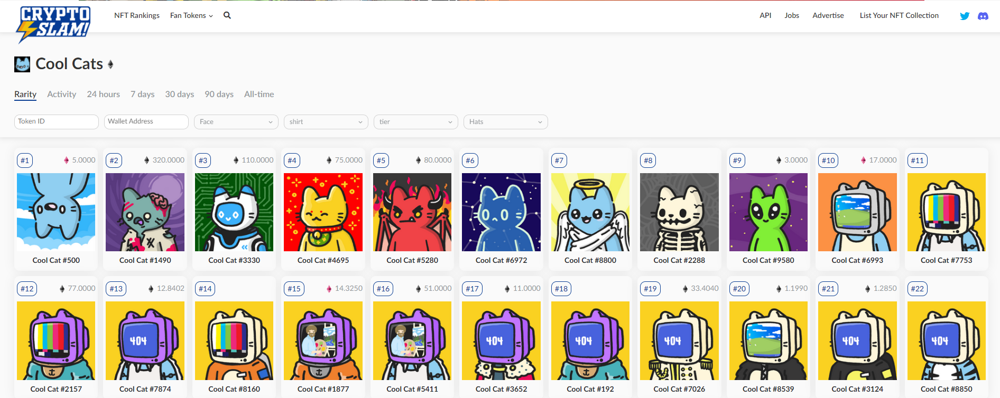

# Predicting how cool is your “Cool Cat”? 

## Analyzing Non-Fungible Tokens (NFTs) to make better investments 

## Executive Summary

Cool Cats are a collection of programmatically random-generated NFTs on the Ethereum blockchain. The 1st generation consists of 9,999 randomly assembled Cats from over 300,000 total options. Cool Cats have a variety of outfits, faces, and colors. Each Cool Cat consists of a unique body, hat, face, and outfit–the possibilities are virtually endless! So, how do we predict how cool is our Cool Cat? 

That is where the magic of machine learning and data science comes into play. We aim to analyze the different traits of Cool Cat, to predict how it will be priced. Our key predictors are the physical traits of the Cat, namely,  

* Face 

* Tier 

* Shirt 

* Body 

* Hats 

Our team members include - 

* Neeraj Kankani (A20347371) 

* Pranjali Pingale (A20348629) 

* Soumyadeep Ray (A20344537) 

* Pankaj Suresh Kumar (A20341747) 

## How cool is my cat? 

Remember, all Cats are cool! Depending on what items your Cool Cat is made of, it may be worth different points than other Cool Cats. Common items, like a beanie or a hat, are worth fewer points than more rare items, like a computer head or an ape outfit. 

`Rarer the above-mentioned traits, cooler is our cat. `

Our recommendation at this point is to analyze the rarity scores from diverse sources to determine whether that will show us a more definitive answer to the correlation between the traits and the market value of the Cool Cat. 

We have also used the actual prices at which the `Cool Cats` are sold, to train and test our predictive models against the actual price trend.

## Statement of Scope

For this project among thousands of NFTs, we chose “Cool Cats” as it is one of the emerging NFTs, and really, how cool are those cats?! Our project objective was to determine whether there is a significant relationship between features of the NFT, and the price/scores it is accumulating on the Open Sea trading space. Further analysis was focused on understanding the nature of the non-linearity of such relations and identifying key variables of importance from our analysis. Ranking data will be our ‘Unit of Analysis’.  The ‘Variables’ we chose to analyze were face, shirt, tier, body, and hats. We collected our data from NftExp,  NFT-Stats and Rarity tools. Also, we explored coolcatsnft.com to get a better idea of the business problem we’re aiming to solve using our analysis. 

## Project Schedule

Here is a summary of the tasks that were involved (and are still to be involved) in this project.  The graphic shows the time periods that each step was (will be) completed in, and which team members were involved in the completion of the steps. 

We divided our Project Deliverable into five phases which comprised of : 

1. Project Initiation 

2. Data Preparation and Analysis 

3. Review and Submission of Deliverable 1

4. Model building & selection

5. Final deliverable and presentation submission

The individuals who own each of these items are mentioned above but are supported by the rest of the team. 

Also, we set up weekly status meetings to discuss about the progress of the project deliverables and handle allocation of tasks to project members effectively. 

## Data Preparation

Data scraping is never a straight-forward task! More so, when proprietary website data is involved. We have tried scarping multiple websites like [OpenSea](https://opensea.io/collection/cool-cats-nft), [NonFungible](https://nonfungible.com/market-tracker/coolcats), and [CoolCatsNft](https://www.coolcatsnft.com/) but because of the security protocols embeded into the html, we were unable to extract the desired data even after trying with multiple libraries like `Selenium`, `Rvest`, and `BeautifulSoup`. 

To find non-proprietary data, which is available for scraping was a huge hurdle for our project. We scoured the internet for NFT websites which have all the data and more importantly, are scrapable with the tools at hand. 

------------------------
We've used [NFT-Stats](https://www.nft-stats.com/rarity/cool-cats-nft) to get important feature information of all the cool cats in our scraped data.

We have used a simple methedology to scrape this website. 
Using Selenium we clicked on each of the cat images, as shown in the screenshot below to scrape the required information. The interface of the website is shown in the screenshots below. 

 

We've created an empty DataFrame object to hold all the relevant data, which was appended after each iteration of the loop.

When you click on each of the CoolCat divs, a pop-up opens like shown below. We clicked on each of the pop ups using xpaths, and scraped the trait values of each cat, along with their scores. We've also done basic data cleaning before storing the data into the dataframe.

------------------------

We have used another source to get the most recent pricing data for the CoolCats. This time we've used a website called [CryptoSlam](https://cryptoslam.io/cool-cats) to scrape the relevant pricing data. We encountered similar hurdles like before, where websites did not allow webcrawlers and libraries like `Selenium`, `Rvest`, and `BeautifulSoup` to access the data. But by the graces of the internet, we were able to find [CryptoSlam](https://cryptoslam.io/cool-cats) which has all the prices data and is allowing access via `BeautifulSoup`. 

The interface of the website is shown below. BeautifulSoup can be a little tricky to understand, therefore, we have attached an [example script](code/Example_scraping_script.py) to extract data using beautifulsoup.

Again we have used a Selenum webdriver to click on each of the images to extract the price data. Further, I have used beautiful soup to get the html page souce, and have parsed the relevant divs from the page source using `find_all` function on a soup object. 

The data that we scraped was in `ETH` currency, which we transformed to its dollar amount using the latest conversion rate of `ETH`. 

We've uploaded the [pricing_source.html](data/pricing_source.zip) as well as the [merged data](data/merged_data.csv) to the [data](/data) folder.

----------------------------------
Important files and links - 

* [merged_data.csv](data/merged_data.csv) The final dataset generated for this project

* [scraping_coolcats.py](code/scraping_coolcats.py) Python file used to scrape data from [NftExp](https://nftexp.io/explore/assets/cool-cats-nft), [NFT-Stats](https://www.nft-stats.com/rarity/cool-cats-nft) to extract all the rare and otherwise features of our coolcats, that will be used as predictors in our pricing models.

* [Example BeautifulSoup Script](code/Example_scraping_script.py) Python file used to demonstrate the functionality of beautifulsoup library on a small html code.

* [scraping_prices.py](code/scraping_prices.py) Python file used to scrape data from [CryptoSlam](https://cryptoslam.io/cool-cats) to extract the pricing data for each CoolCats.

* [data_cleaning.py](code/data_cleaning.py) Python file used to clean, consolidate, and transform the scraped data.

### Data Access

We scraped the data about the Characteristics of Cool Cats from [NftExp](https://nftexp.io/explore/assets/cool-cats-nft)

Further, we scraped the Rarity metrics for each of the unique Cool Cat from [NFT-Stats](https://www.nft-stats.com/rarity/cool-cats-nft) 

Finally, we got the current ranking data for cool cats from [Rarity Tools](https://rarity.tools/cool-cats-nft) 

### Data Cleaning

The data we scraped was full of inconsistencies across the different data sources. We cleaned the  NFTExp, NFT-Stats, and Rarity Tools as there was some cleanup that needed to be done to make the data useable. The first thing we noticed was that the Cool Cat number were not listed the same in NFTExp and NFT-Stats as they were in the other two sources. This allowed us to then merge the tables on cool cat's number.  

Initially, we scraped a total of `9941` CoolCats, but due to the unavailablity of rank data for a number of CoolCats, we were left with `8779` CoolCats with ranking data because we had no option but to remove the data with missing rank values. Further, the number of CoolCats were missing tge price information because they were never traded on open market, therefore after merging the price data we were left with `7292` CoolCats.

### Data Transformation

Data Cleaning and Transformation 

Paragraph locked by Pingale, Pranjali
Initially we extracted the data from the website as lists and dictionaries. Then we split the lists to insert the scores and characteristic traits in the respective columns. 

Also, there were missing rarity scores of each of the Characteristics of the Cool Cats. We identified the missing traits and replaced their scores with an average of the scores of that particular trait.  

### Data Reduction

We have to do some data reduction when it comes to the rankings of the Cool cats from Rarity Tools.  

We realized that we were missing rank values from the data we scraped. There were multiple Cool Cats without a proper Rank assigned to them. Since rank is an irreplaceable metric, so we decided to drop the rows to have a better understanding of the data.

### Data Consolidation

After we formatted all the data into the appropriate formats and adjusted the Cool Cat names in the sources to match across all sources, we were able to use the merge function in Python to merge our multiple data frames into a single file for analysis. 

### Data Dictionary

A short description of the scraped table below. The example row is the first row taken from [merged_data](data/merged_data.csv) file which is uploaded on the [data](/data) folder. 

| Attribute Name | Description | Data Type | Source | Data | Example |
|:---|:---|:---:|:---|:---|:---:|
| cat_number | Unique identifier for a Cool Cat | integer | [NftExp](https://nftexp.io/explore/assets/cool-cats-nft)  | [merged_data.csv](data/merged_data.csv) | `4` |
| Rank | Ranking for each Unique Cat based on Rarity | integer | [NftExp](https://nftexp.io/explore/assets/cool-cats-nft) | [merged_data.csv](data/merged_data.csv) | `9413` |
| face | Emotion and Shape of face | string | [NftExp](https://nftexp.io/explore/assets/cool-cats-nft)  | [merged_data.csv](data/merged_data.csv) | `unamused` |
| face-score | Rarity score of shirt variable | float | [NftExp](https://nftexp.io/explore/assets/cool-cats-nft)  | [merged_data.csv](data/merged_data.csv) | `2.0` |
| shirt | Color and kind of shirt | string | [NftExp](https://nftexp.io/explore/assets/cool-cats-nft)  | [merged_data.csv](data/merged_data.csv) | `buttondown tan` |
| shirt-score | Rarity score of shirt variable | float | [NftExp](https://nftexp.io/explore/assets/cool-cats-nft)  | [merged_data.csv](data/merged_data.csv) | `8.6` |
| body | color and body type | string | [NftExp](https://nftexp.io/explore/assets/cool-cats-nft)  | [merged_data.csv](data/merged_data.csv) | `blue cat skin` |
| tier | classification classes | string | [NftExp](https://nftexp.io/explore/assets/cool-cats-nft)  | [merged_data.csv](data/merged_data.csv) | `cool_1` |
| tier-score | Rarity score of tier variable | float | [NftExp](https://nftexp.io/explore/assets/cool-cats-nft)  | [merged_data.csv](data/merged_data.csv) | `1.2` |
| hats | Color and kind of hat | string | [NftExp](https://nftexp.io/explore/assets/cool-cats-nft)  | [merged_data.csv](data/merged_data.csv) | `hat white` |
| hats-score | Rarity score of hats variable | float | [NftExp](https://nftexp.io/explore/assets/cool-cats-nft) | [merged_data.csv](data/merged_data.csv) | `5.0` |
| total | Sum of Rarity score of each Cat | float | [NftExp](https://nftexp.io/explore/assets/cool-cats-nft)  | [merged_data.csv](data/merged_data.csv) | `11.8` |
| price | Last traded Price of each Cat in ETH | float | [CryptoSlam](https://cryptoslam.io/cool-cats)  | [merged_data.csv](data/merged_data.csv) | `11.49` |
| currency | Currency of Last Traded Price | String | [CryptoSlam](https://cryptoslam.io/cool-cats)  | [merged_data.csv](data/merged_data.csv) | `ETH` |
| dollar-price | Dollar equivalent of Last Traded Price for each Cat | float | [CryptoSlam](https://cryptoslam.io/cool-cats)  | [merged_data.csv](data/merged_data.csv) | `33877.92` |

## Descriptive Statistics and Analysis

Our exploratory analysis looks at various data sets in which we reviewed the data structure and generated plots, histograms, and summary characteristics. After merging both the feature information and the price data for CoolCats, we got a merged dataframe with 7292 rows and 14 columns. 
Below is the descriptive statistics like mean, median and interquatile range for all the numerical variables in the dataset.

- cat_number - It is an identifier. The value of the varible is of no utility but to single out a specific cool cat.

- rank - It provides us with a sequence of a decreasing order interms rarity. Hence the statics do not hold significant utility.

- face-score - Has a mean value of 11 and a significantly large standard deviation of ~100. It is important to keep in mind that only 69/7292 have a score greater than 10, those scores range between 331 - 3275 considerably greater than 75th %ile value of 7.3.

- shirt-score - Has a mean value of 39 and a standard deviation of ~100. There are 6 values of 3267.8 all the remaining values range between 0 - 166.9

- tier-score - Has a mean value of 5 and a standard deviation of 7. The ~75th %ile value is 5.

- hats-score - Has a mean value of 43 and a significantly large standard deviation of ~101. The 75th %ile value of 66.7 and a max of 3273.

- total - Sum of rarity scores that helps arrive at a rank for each cool cats. The scores range between 0.2 to 9878 and exibit a variance of 293.

- price - The price in ETH. Mean price is 5.9. The 25th %ile is 0.79 amd 75th %ile is 9. The Max value is 320.

## Visualizations

### Narrative 1 - Between Tiers and Dollar-Price

With each tier that the CoolCat is classified in, it brings along a seperate traits for each of the definative feature of the cat, namely, hats, face, shirt and body. Because of the different traits, each of the cats are priced differently on the open market. 

While, some tiers are rarer than others thus getting more price from the collectors. But there are a number of distinct cats in lower tiers which are fetching a pretty penny. As you can notice in the chart below, the exotic tier is the one which is able to gather the most amount of money from collectors. But if you look closely, it is also the one which is leading to lowest prices. This can be explained by the simple risk and reward principle. Since the tier is exotic, some of the Cats will be a huge hit with the collectors, while others not so much. Therefore, not all exotic cats are fetching good prices on the market. The same anology can be extended to other classes of tier variable to explain the distribution of price.

### Narrative 2 - Between Ranks and Dollar-Price

Ranks or the rarity of the cats is a directly related factor in determining the price it fetches on the open market. Lower the rank, more is the rarity of the cat, and thus higher the price it can gather from collectors. Being a collector of coins myself, having a rarer coin is like a badge of honor for me. Also, you can notice that their is an exponential decay in prices as ranks go up. Thank can be understood as, for the first few hundred cats, the collectors are prone to spending a bit more since they'll receive the bragging rights along with the NFT. But after the rank of 5000, there is not a significant decay on the price with the ranks. That must be because after a while rank of the cat hardly makes any difference in attracting the collectors. 

Also, one more thing to notice in the below visualization is the density f the number of cats and the price it fetches. At lower ranks, a lot of cats fetch almost similar price, there the color is a darker hue of red. Similarly, for the lower ranks, the prices the cat gather vary a lot, thus the density of plot is much lower. 

### Narrative 3 - Between Total Score and Dollar-Price

Total score is the score of each CoolCat based on the rarity associated with each feature of the cat. Thus total score can be treated as a numerical feature to express how rare a particular cat is. You can notice right away that, higher the total score, more is the price fetched by the NFT in the open market. 

You can also notice that cats are abundunt in the lower scores region, thus, the difference in prices is going to be very competitive in that region. But with higher scores, the disparity increases since collectors are willing to spend a little more than usual for rarer cats. 

As you can see, the average prices that CoolCats fetch in their particular tier is plotted below. Exotic tier has the Cats which fetch the most money from collectors because of the nature of rarity of the tier. Lower the rarity, worse is the price collected by the NFT.

Below is the distribution of each of the predictors with the Target variable `Dollar-price`.

You can notice that the relationship of Dollar-price fetched by the coolcat is almost linearly related to `face-score`, `hat-score`, `shirt-score` and `tier-score`. 

- Total score has a positive correlation with the Price fetched. Also, the disparity increases drastically as the cats become more rarer.
- Rank has a inverse or negative correlation with the Price fetched. Similarly, the disparity increases drastically as the cats become more rarer.

Below is a pairplot of each of the numerical feature to express the rarity of the cat, and the prices it is able to fetch in the open market.

Distribution of standardized (Scores) are visualized using Box and Plots and Histograms.

Box Plots - 

-----------------------------------

Histograms -  

Depicts the distribution of standardized scores after the exclusion of 0-499 ranked cats. 

-----------------------------------

We identified that Hats-score followed by Shirt-score, are the two most important criterion in determining the Rarity of a Cool Cat. This is a major finding in understanding which cat can fetch a better price for collectors.  

A Pair plot is used to highlight pair-wise correlations among the various aspects our cats are being scored on – Face, Shirt, Tier and Hat. The Hue indicates the different rank buckets we have grouped them under.  

Our analysis showed us that there is some correlation between rarity scores and the ranks of the cool cats. Some characteristic traits were more predominant than others. For instance, we found that the average Hats and average Shirts score had higher impact on the overall rarity scores of the cool cats. 

### Conclusion and Discussion of Data Visualization

- Rarer the value of the characteristic traits, better ranked is the Cool Cat NFT.  
- And rarer the coolcat, better is the price it can fetch in the open market.
- Further, we found that rarer the Cat, higher is the demand for that NFT in the Open Sea Market Place.
- We found through our analysis that Shirt and Hats have a better correlation with the Total Score or Rarity of the Unique Cats.
- Some traits like exotic_2 and wild, fetch better price in open market than others.
- It will be good to use `logistic regression` since most of the variables are linearly related to the Target variable. 
- One can use more complex models like `decision tree`, and `randon forest` to identify different decision rules in predicting the price a CoolCat will fetch given the values of predictors. 
- Further, models like `Naive Bayes` are assumes indenpence of predictors, which makes them ideal fit where no correlation between predictors is the case. For our case, there is no correlation between individual features of the Cats since those are autonomous design features.

Through this analysis, we got to understanding the working of NFTs, and how they create value. Further, we demystified the art behind the Non-fungible tokens, and accessed how each of the characteristics change the ranks of the NFTs.

So, finally this analysis will help individuals and organizations into better allocation of funds for investment purposes in NFT marketplace.

## Select Modeling Techniques 

Prediction of dollar-price with higher accuracy will allow the designer of cats to identify which features are leading to a better price in the open market. This will inturn will generate more revenue for the designers. Thus it is important to identify models and features which are leading to high accuracy for the prediction of tiers and dollar-price of the CoolCats.

For our baseline model, we have used `Logistic` and `Ridge regression`. We have used this model, because most of our predictors are linearly related to our target variable. This will ensure that our model is able to train over the linear relationships, and hence will be able to predict the target variable with assumption of linearity between the tiers and all the predictors. Further, assessing the classsification correctly will ensure that the designer is able to create more exotic cats, and thus fetching more price for his cats. The assumptions built around a regression model include linear relationships, normally distributed errors, homoscedasticity of errors, and independence of the observations. These assumptions were assessed in the descriptive analysis of the data. We recognize that several relationships have week linear, or possible nonlinear, relationships. We have not made adjustments to these relationships as they are challenging to fully assess with our large number of variables. We have decided to allow the model to determine the strength of the relationships and review the error for distribution and homoscedasticity. We believe our sources and observations of the data to be fully independent.

Further, along with Stratified KFold Cross Validation, we have used an array of models to classify `tiers` of our CoolCats. 

Below is the list of models used along with their strengths and weaknesses in classifying tiers based on our predictor variables - 

- `Naive Bayes Classifier` 
We have used naive based classifier because it assumes that all the predictors are independent. This will encourage the model to assume their is no correlation between the various predictors like hat-score and face-score, and produce results without any bias. Further, models like `Naive Bayes` are assumes indenpence of predictors, which makes them ideal fit where correlation between predictors is ignored. For our case, there is no correlation between individual features of the Cats since those are autonomous design features.

- `Decision Tree Classifier`
We used a decision tree classifier to create decision rules that can help us explain how each class of the tier is classified based on the splits created on predictor variables to maximize information gain. In essense, it will help us identify the variables which are more important in classifying tiers and fetch more price for the designers. 

- `Random Forest Classifier`
We used a Random Forest classifier to identify important variables that can help us explain how each class of the tier is classified and how a cat is deemed to be exotic. This will also help us accumulate the results from the decision tree and reduce the bias generated by one single decision tree. This model will fit many distinct decision trees to the training data, each of which will be built separately on a subsample. We will then aggregate the trees to determine which variables appear most often as the first and most crucial split. At the same time, we will gather the average decision rules across all of the aggregated trees. In theory, decision trees and Random Forests make no substantive assumptions about the distribution or structure of the data. However, there are some requirements and limitations imposed by the implementation through SKLearn in Python. The biggest of these limitations is that the RandomForestClassifier object with SKLearn does not handle missing data. Because of this, we will need to remove rows with missing data or impute values to replace them. Another requirement is that the data must be in a numeric form. This means that any categorical data will need to be converted to a numeric data type. Having a random forest model for prediction, will ensure that the designers gets a much more generalized view on the important variables, and thus will be less prone to creating NFTs that are not sold in the open market.

- `Artificial Neural Network`
Using an artificial neural network, the designer will be able to understand the underlying non-linear relationships between the predictors like hats, face etc. to understand how they influence the tier classification of the Cat. Further, assessing the classsification carrectly will ensure that the designer is able to create more exotic cats, and thus fetching more price for his cats. 

## Assumptions of the models

- `Logistic Regression model` - 
Regression model aims to find how the tier of the cool cat gets affected by changes in the accessories and the attributes used to create the cat.
Below are the assumptions built around the regression model:
i) Linear relationship between dependent variable with independent variables.We performed exploratory analysis on our data and as we can see in the above sections, independent variables mostly have linear relationship with dependent variable 'tier'.
ii) The predictor variables should not be linear functions of each other and should be independent.Again as we can observe from the exploratory analysis in the above sections, most independent variables do not have linear relationship with each other thus satisfying the assumption.
iii) The data set should be large enough in size to get reliable results. We have 7292 records which are large enough to get definitive results.
iv) Normally distriubted errors - On creating a plot of residuals, we found that errors are less densly distributed on the tails and more near the mean. Also, the shape of the resembles a bell, much like that of normal distribution.
v) Homoscedasticiy of errors - 

- `Decision Tree and Random Forest -` 
The major assumption to use decision tree is that  there is no necessity ot have any direct relationship between the target variable and independent predictors. Since we have a huge dataset and variables are indeendent of each other, we can use decision tree or random forest for our modeling purposes. Also, the data used is numerical, which can be assessed by decision tree to create splits. 

- `Naive Bayes -` 
We have used naive based classifier because it assumes that all the predictors are independent. This will encourage the model to assume their is no correlation between the various predictors like hat-score and face-score, and produce results without any bias. Further, models like Naive Bayes are assumes indenpence of predictors, which makes them ideal fit where correlation between predictors is ignored. For our case, there is no correlation between individual features of the Cats since those are autonomous design features.

- `Artificial Neural Network - `
Artificial Neural network require large amounts of data to learn the underlying patterns within the data. We have 7292 rows of data, which is sufficient to train a neural network. Further, neural network can only work on numerical data. Also, ANN trains efficiently when the data is scaled. We have encoded and transformed all the values to be scaled such that it is ready to be trained by a neural network. 

## Data Splitting and Sub-Sampling

To train the model, we needed to separate the data into training and validation sets. We chose to use 66.67% of the data as a training set and the remaining 33.33% as a validation set. We split the data to balance the need for the training data to be sufficiently large for the models to learn the relationships and small enough to avoid overfitting as much as possible. We tried several different split ratios and found that 1/3 for the validation set produced results that were consistent and balanced the needs of the models. The features for the data are scaled using MinMax scaler to ensure that the model is able to train efficiently and is able to converge well. Further, when all the features are scaled, it ensures that one feature does not dominate over other features. 

Further, we have used stratified cross validation with 5 folds, to ensure that every bit of data is used in training and testing of the model. Stratified folds removes the need of creating a dedicated validation set, thus removing the bias created by partitioning the data. Moreover, since the folds are stratified, it ensures that model is trained equally on all the class training rows. Decision trees, random forest, and regression models often perform better when the predicted classes are balanced.

Tier variable is label encoded because it is a multi-class target variable. Using binary encoder, or one hot encoder will not serve the purpose here, therefore we decided to label encode the 8 different classes from 0 to 7. 

For training of Artificial Neural Network, we've created a validation set of the size of 20% of the training set. This validation set will help in reducing the validation error and improving the accuracy of the model in the backpropogation step. Also, scaled features help ANN in training efficiently.

## Build the Models

**Model 1- (Baseline Model: Ridge Classifier, Logistic Regression)**

Now, we are all set to start building our models.

So, we started with creating a baseline model to get a fundamental understanding of the behavior of the features towards the target variable.

The baseline model consists of basic multi class classifiers, namely:

1. Logistic Regression
1. Ridge Classifier

Basically, logistic regression works on binary classification. But here we have retrofitted it in a multi class classification problem.

For that, we have used the hyperparameter ‘multiclass’ which imposes the binary classification on each class.

In case of Ridge Regression, it converts the ‘tier’ classes into {-1,1} and then treats the problem as a regression task.

We found that the baseline model has a poor accuracy. We can understand that because we have passed the maximum number of features, even the irrelevant ones.

For Ridge Classifier, the accuracy was 0.5367677606979643 i.e., **53%**

and for Logistic Regression the accuracy was 0.6809306190278355 i.e., **68%**

Also, this model helped us to set a benchmark so that we can use better modelling techniques on the data.

**Model 2- (Naïve Bayes)**

Now, we built a Gaussian Naïve Bayes which is based on the Bayes theorem. We chose to use stratified folds of the data so that we can there is an independence between the data folds and the features.

We found that the independent scores of the cool cats are kind of discrete. But the individual scores of the properties like face, hats and shirts add up to the total score.

This might have led to a correlation between a few of the features like hats-score, face-score, etc.

For the various stratified k-folds, we found the accuracies and then took a mean of those to get the model accuracy of the entire dataset.

The accuracy was 0.6132 i.e., **61%**. 

We have used **GridSearchCV** to find the best parameters suited for the data and the model.

There are not much hyper parameters available for GaussianNB except variable smoothing.

We used the best estimator to find the value of ‘**Variable Smoothing’** to be **8.111308307896872e-07**

We got the following classification report for the Naïve Bayes model.

**Model 3- (Decision Tree)**

We used a tree-based classifier namely, Decision Tree.

For this model also, we provided the train and test data in the form of stratified k-folds.

This model helped to find the answers to the questions like the relations between the face-score and tier-classes and so on.

Eventually, the leaf nodes got the answers to the questions raised. 

For the various stratified k-folds, we found the accuracies and then took a mean of those to get the model accuracy of the entire dataset.

The accuracy was 0.8134 i.e., **81%**. 

We also used **GridSearchCV** on this model to find the best parameters suited for the data and the model.

There are several hyper parameters available for Decision Tree.

We used the following hyper parameters.

'min\_samples\_split': sample\_split\_range,

`              `#'max\_features': ['auto', 'sqrt', 'log2'],

`              `'ccp\_alpha': [0.0, 0.1, .01, .001],

`              `#'max\_depth' : [5, 6, 7, 8, 9],

`              `'criterion' :['gini', 'entropy

We found the best estimators for this model are:

**criterion='entropy',** 

**min\_samples\_split=9,** 

**random\_state=42**

We got the following classification report for the Decision Tree.

**Model 3- (Random Forest)**

Our Random Forest model fit two thousand different decision trees to the data, using five stratified folds from the training data.

We chose to use less than all the data for each tree to reduce overfitting when the model is tested against the test data.

On using cross validation, we got a mean accuracy of **84%** 

Furthermore, on using GridSearchCV for finding the hyper parameters, we found that the following parameters contributed to the best estimator model.

**criterion='entropy',** 

**n\_estimators=500,** 

**random\_state=42**

On constructing the forest by the model, we found that the split on the total scores was the most common first split that appeared in almost 18% of the trees created.

Due to the randomness that we assigned (=42), the exact number of splits within the cross validated data varies by a little. 

The top variables for the model are:

1. Dollar-price
1. Total score
1. Tier-score

Here, we find that the total score has a strong correlation between the price in dollars with the total score.

We got the following classification report for the Random Forest model.

**Model 4- (Artificial Neural Network)**

Finally, we used a neural network to classify the various tier classes.

Here, we split the data into train, validation and test with validation having 20% of the train data.

The test data comprised of 3% of the dataset.

It consisted of an input layer that had six inputs and the output had eight variables.

In between the input and the output layers, we added two hidden layers of 32 neurons each.

Also, we used the activation function ‘relu’ (Rectified Linear Unit) as the function of evaluation for the hidden layers.

Since it is a multi-class classification problem, so we used ‘softmax’ as the activation for the output layers.

For optimizing the loss, we used ‘Adam’.

Initially, we ran the model with 50 epochs.

We found that the final loss value to be 0.71 which was too high.

So, we increased the number of epochs to 100.

This resulted in reduction of loss value to 0.4457

Also, the accuracy of the model increased to **80%.**

We found the following trend of loss and accuracy.

We got the following classification report for the Neural Network model.

## Assess the Models 

Our models employed entirely different methods for assessing the challenge of identifying the most critical variables that impacted the rarety and valuablity of a NFT. From logistic regression which is a statistical modelling technique which assumes the linearity between predictor and target to Naive Bayes, Decision Tree, Random Forest and Artificial Neural Network, which are all efficient in modeling non-linear data. Our random forest model focused on using classification techniques, while our regression model focused on correlations and linear relationships. While this can make comparing the models somewhat challenging, employing both techniques provides valuable insight into the data. The random forest model had an overall accuracy of 82%. In comparison, our logistic regression has an accuracy of 68%. Out of all our models, Random Forest has the highest accuracy and Logistic Regression has the lowest accuracy.

The random forest model's strengths include how simple the model's conclusions are to comprehend and how accurate it is at forecasting an NFT's tier and valuation. The capacity to run several decision trees and aggregate them was another strength of the random forest model we employed. Unbalanced data also works well with random forest models. Random forest models, on the other hand, have the drawback of being unable to forecast outside of the training data range and of over-fitting huge complicated data sets. Furthermore, each model run is somewhat different, and the tree cutoffs are arbitrary and vary from model to model.

The capacity to forecast outside of the training set is a strength of regression models, as is the ability to prevent multicollinearity using VIF calculations. Regression models are straightforward to execute and may be regularized to avoid overfitting. Regression models have a poor performance with nonlinear relationships, which is one of its flaws. Nearly all interactions with the target variable did not display clear, strong linear trends, which presents a problem for our model. This results in a greater residual standard deviation and a difficulty in attaining higher R-squared values. Outliers can also distort the data, and the nature of the prediction model makes it difficult to understand. For our data, since it is prove to outliers, it is best not to rely on regression for prediction of NFT tiers.

Overall, our team feels that the random forest model is better for our research and objectives. The model's output is simple to comprehend. Also, andom forest reduces the bias created by a single decision tree. Further, random forest will give variable importance for our data, which can help in designers in inderstanding the market and consumer behaviour. Overall, random forest is the best model which is able to generate a accuracy of 82%. 

## Conclusion and Discussion

Identifying and predicting the prices of NFTs is a complex task. How a NFT will perform in the open market is based on multitude of factors beyond the understanding of designer. Thus, predicting the tier of a NFT can help the designers in accessing the market behaviour, and thus model the NFTs to fetch the most price in open market.

The model trained using the random forest algorithm is found to have the best predicition accuracy when tested on the validation set. The average accuracy for the model over 5 folds of startified K-folds was 82%. This model will help designers in understanding key variables that affect the tier classification of an NFT. Further, it will help demystify how and why people consider a particular NFT to be rare and hence worth a lot more than a common NFT. 

We could not access websites like OpenSea to get dynamic price data over time for the NFT. Further, due to lack of computational resources like GPU, we could not create additional features for our classifier models based on image classification techniques. 

We have taken price as a constant for our modeling purposes. To continue this research, we would like to take price as a dynamic variable over time to understand for each NFT, how does time plays a factor in determining its current price. We will perform time series analysis to identify the influence of time of our target variable. 

